# ST05 (Oracle has more options than any other database) 

Set the parameters 
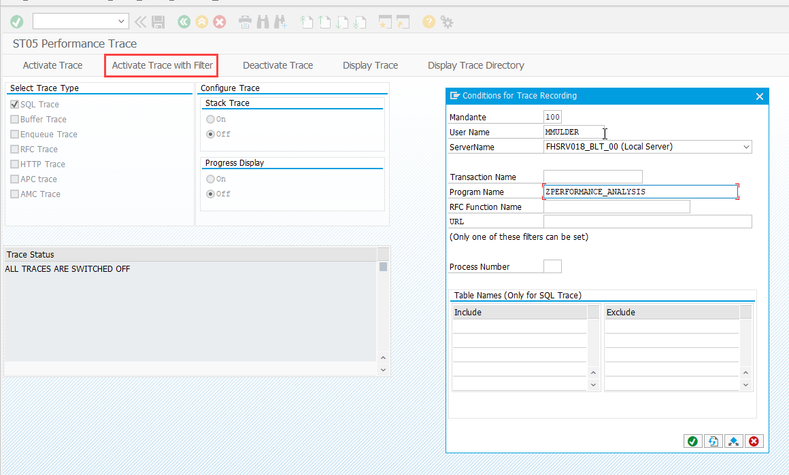

Execute the process what you want to do the performance analisys 

Combine SQL statements
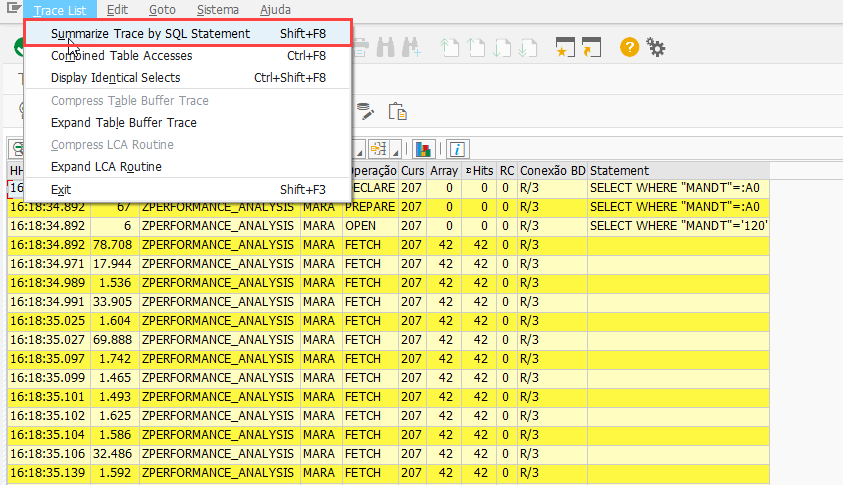

The duration column measure is microseconds. You can use https://convertlive.com/u/convert/microseconds/to/seconds to convert. 
In this case was 12.386.327 microsends, in seconds is 12,38s. 

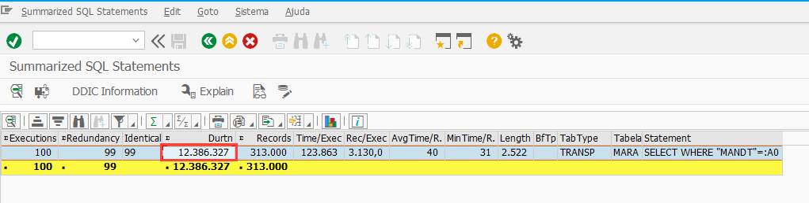

To see the CPU/Process usage, click in the 'Explain' (F9) option.

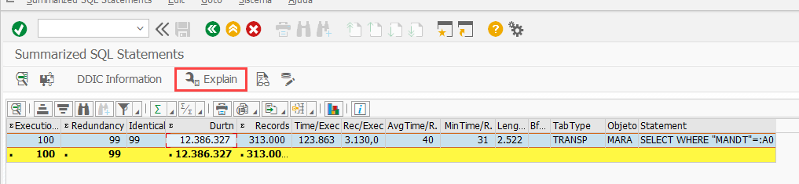

Details without index usage: 

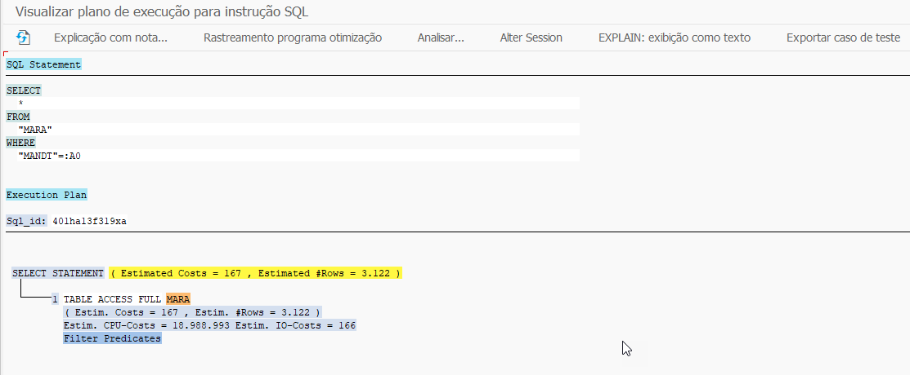

Details with index usage: 

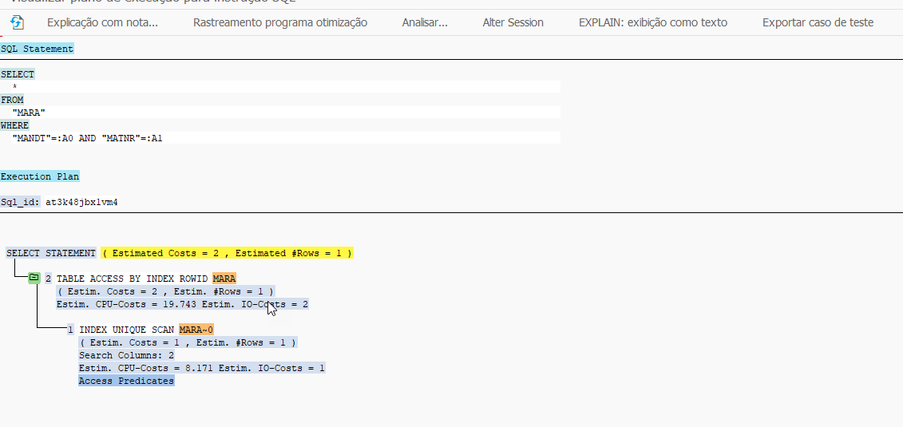

# Important things to analyze: 

# 1- DDIC Information (F2)

This analyze the index available for the table. 
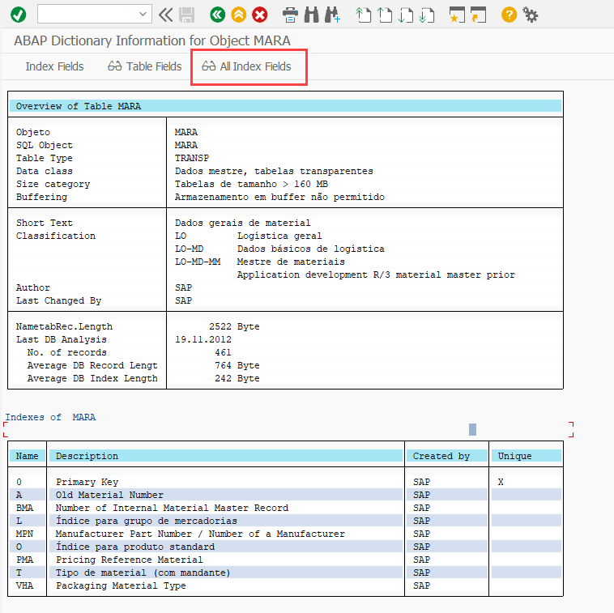

For the literal name fields click in the 'Index Table Fields' 
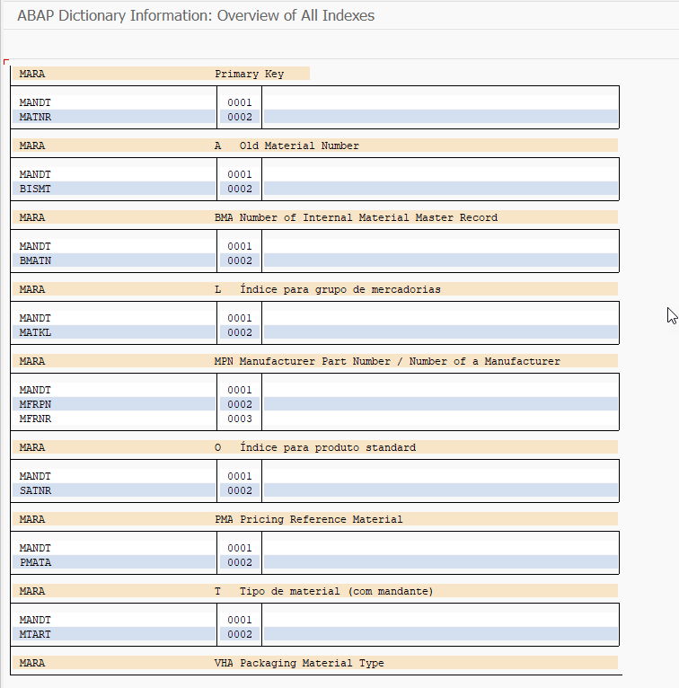

# 2 - What fields is being selected at the statement (SHIFT + F2)

Some of databases in ST05 show all the columns when * is used, another show only the * . 

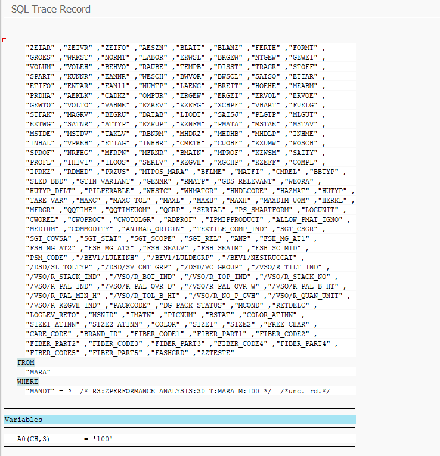

# ST05 fields and screen can be different based on the database of the server. 

Example:

Informations of ddic and abap statement
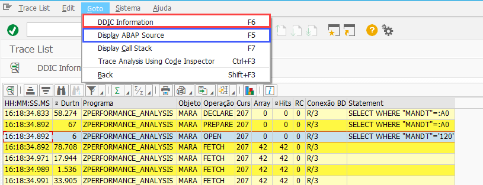

In some other databases:
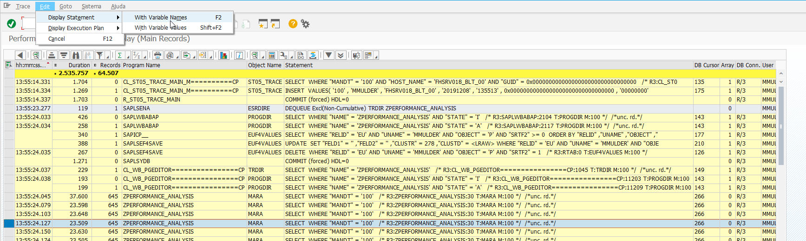

Sumarize SQL statements in other database:
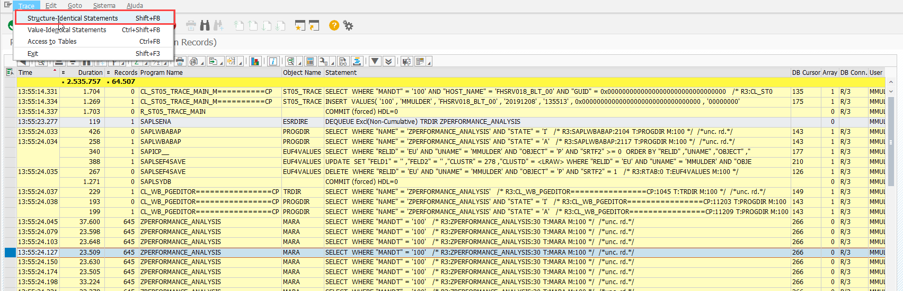

